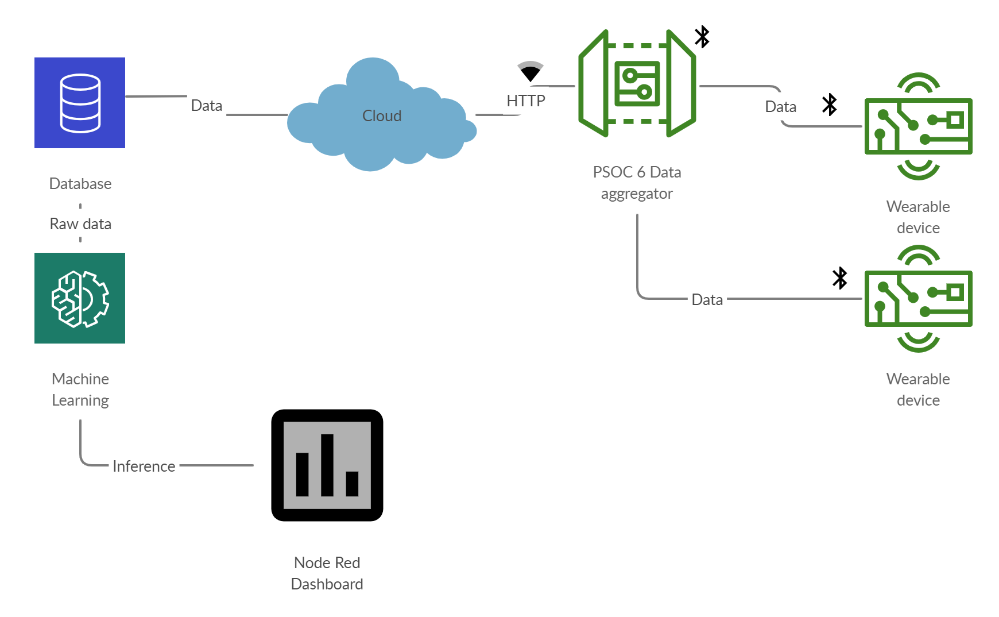

# Isolation ward patient monitor 

## Idea
In many places medical students are having to manually take readings from the COVID-19 isolation wards. This is not good for them as they might be infected by the virus. So, I started building a simple application that collects data via sensors, then processes the data, sends it to a cloud storage , inputs it to a ML pipeline and displays the inference along with the patient data on a online dashboard. 

## Project Block Diagram

## Description
The main key components of this design are : 

    1. CY8CPROTO-062-4343W (Data aggregator)
    2. STM32 based wearable devices (BLE based)
    3. Cloud Storage
    4. Cloud based Machine Learning pipeline
    5. Node Red dashboard
    
### CY8CPROTO-062-4343W
#### Introduction

The PSoC 6 Wi-Fi BT Prototyping Kit (CY8CPROTO-062-4343W) is a low-cost hardware platform that enables design and debug of PSoC 6 MCUs. It comes with a CY8CMOD-062-4343W module, industry-leading CapSense® for touch buttons and slider, on-board debugger/programmer with KitProg3, microSD card interface, 512-Mb Quad-SPI NOR flash, PDM microphone, and a thermistor. It also includes a Murata LBEE5KL1DX module, based on the CYW4343W combo device.

The PSoC 6 Wi-Fi BT Prototyping Kit can be evaluated using ModusToolbox. It provides you with the PSoC 6 Software Development Kit (SDK) to evaluate and start designs with the unique and differentiating features of the PSoC 6 MCU portfolio, such as CapSense, Full-speed USB and other peripherals. For this project most of the coding will be done from the ModusToolbox.

