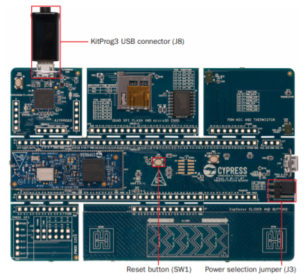

# Isolation ward patient monitor 

## Idea
In many places medical students are having to manually take readings from the COVID-19 isolation wards. This is not good for them as they might be infected by the virus. So, I started building a simple application that collects data via sensors, then processes the data, sends it to a cloud storage , inputs it to a ML pipeline and displays the inference along with the patient data on a online dashboard. 

## Project Block Diagram

## Description
The main key components of this design are : 

    1. CY8CPROTO-062-4343W : Data aggregator
    2. STM32 based wearable devices : BLE based
    3. Cloud Storage
    4. Cloud based Machine Learning pipeline
    5. Node Red dashboard

